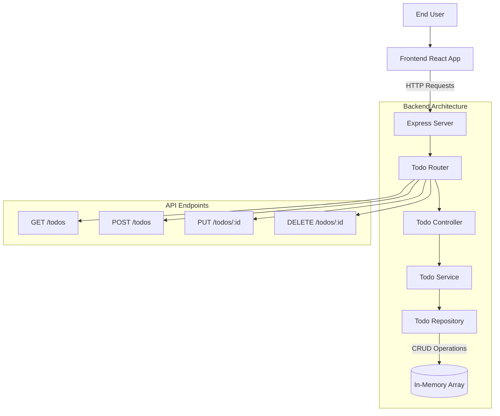

# ToDo List Application Plan

**Project Root:** `terrific/fullstack todo app/`

## I. Backend (Node.js, Express, TypeScript)

(Located in `terrific/fullstack todo app/backend/`)

1.  **ToDo Item Model Definition (`todoModel.ts`)**:

    - Define a Zod schema for a ToDo item.
    - Fields: `id` (string, UUID), `text` (string), `isDone` (boolean, default: false), `createdAt` (Date), `updatedAt` (Date).
    - Location: `src/api/todo/todoModel.ts`

2.  **Data Persistence Strategy**:

    - For the initial version, an **in-memory array** will be used to store ToDo items. This simplifies setup, but data will be lost on server restart.
    - This can be later replaced with a database (e.g., PostgreSQL, MongoDB).
    - Location: Implemented within `src/api/todo/todoRepository.ts`.

3.  **ToDo Repository (`todoRepository.ts`)**:

    - Functions for CRUD operations on the in-memory store:
      - `create(data: CreateTodoDto): Promise<Todo>`
      - `findAll(): Promise<Todo[]>`
      - `findById(id: string): Promise<Todo | null>`
      - `update(id: string, data: UpdateTodoDto): Promise<Todo | null>`
      - `remove(id: string): Promise<boolean>`
    - Location: `src/api/todo/todoRepository.ts`

4.  **ToDo Service (`todoService.ts`)**:

    - Handles the core business logic for managing ToDo items, interacting with the repository.
    - Input validation and transformation.
    - Location: `src/api/todo/todoService.ts`

5.  **ToDo Controller (`todoController.ts`)**:

    - Functions to handle incoming HTTP requests for each ToDo operation.
    - Calls the appropriate service methods.
    - Formats responses.
    - Location: `src/api/todo/todoController.ts`

6.  **ToDo Router (`todoRouter.ts`)**:

    - Define Express routes for ToDo operations:
      - `POST /todos`: Create a new ToDo item.
      - `GET /todos`: Get all ToDo items.
      - `GET /todos/:id`: Get a specific ToDo item.
      - `PUT /todos/:id`: Update a ToDo item (text, mark as done/undone).
      - `DELETE /todos/:id`: Remove a ToDo item.
    - Integrate with OpenAPI (`zod-to-openapi`) for documentation.
    - Location: `src/api/todo/todoRouter.ts`

7.  **Integrate ToDo Router into Express App (`server.ts`)**:

    - Add the `todoRouter` to the main application in `src/server.ts`.

8.  **API Documentation**:
    - Ensure all ToDo endpoints are documented using `zod-to-openapi`, similar to existing user routes.

## II. Frontend (React, TypeScript)

(Located in `terrific/fullstack todo app/frontend/`)

1.  **Shared ToDo Item Type (`todo.types.ts`)**:

    - Manually define a TypeScript interface for `TodoItem` matching the backend model. This allows for clear type definitions on the frontend.
    - Example:
      ```typescript
      // src/types/todo.types.ts
      export interface TodoItem {
        id: string
        text: string
        isDone: boolean
        createdAt: string // Consider using Date type if transforming, otherwise string for ISO
        updatedAt: string // Consider using Date type if transforming, otherwise string for ISO
      }
      ```
    - Location: `src/types/todo.types.ts` (new file)

2.  **API Service Module (`todoApiService.ts`)**:

    - Functions to make API calls to the backend ToDo endpoints using `ofetch`.
    - Base URL for API calls (e.g., `http://localhost:8080` or from an environment variable).
    - Functions for:
      - `fetchTodos(): Promise<TodoItem[]>`
      - `createTodo(text: string): Promise<TodoItem>`
      - `updateTodo(id: string, updates: Partial<Pick<TodoItem, 'text' | 'isDone'>>): Promise<TodoItem>`
      - `deleteTodo(id: string): Promise<void>`
    - Error handling for API requests.
    - Location: `src/services/todoApiService.ts` (new file)

3.  **State Management (`todoStore.ts`)**:

    - Utilize the existing Zustand store setup (`src/features/todo/todoStore.ts` and `src/utils/useZustandCreate.ts`).
    - **State Interface (within `todoStore.ts`)**:
      ```typescript
      interface TodoState {
        todos: TodoItem[]
        isLoading: boolean
        error: string | null
        fetchTodos: () => Promise<void>
        addTodo: (text: string) => Promise<void>
        removeTodo: (id: string) => Promise<void>
        updateTodo: (id: string, updates: Partial<Pick<TodoItem, 'text' | 'isDone'>>) => Promise<void>
        toggleTodo: (id: string) => Promise<void> // Convenience for updating isDone
      }
      ```
    - **Store Implementation**:
      - `todos: TodoItem[]`: Initialized to `[]`.
      - `isLoading: boolean`: Initialized to `false`.
      - `error: string | null`: Initialized to `null`.
      - **Actions**:
        - `fetchTodos`: Sets `isLoading`, calls `todoApiService.fetchTodos()`, updates `todos` or `error`, unsets `isLoading`.
        - `addTodo`: Calls `todoApiService.createTodo()`, on success adds new todo to `todos` list.
        - `removeTodo`: Calls `todoApiService.deleteTodo()`, on success filters `todos` list.
        - `updateTodo`: Calls `todoApiService.updateTodo()`, on success maps `todos` list to update the item.
        - `toggleTodo`: Gets the specific todo, then calls `updateTodo` with the inverted `isDone` status.
    - Ensure all types within the store (`set`, `get`, state, actions) are correctly defined.
    - Components will use `const { todosStore } = useTodoStore()`. Reactive state access is done via selectors. Actions are called by selecting the action function from the store or by using the store's `getState()` method.

4.  **Components**:

    - **`Todos.tsx` (Container/Page Component)**:
      - Location: `src/features/todo/Todos.tsx`
      - Uses `useTodoStore()` to access state (`todos`, `isLoading`, `error`) and actions.
      - Calls `todosStore.fetchTodos()` on component mount (`useEffect`).
      - Renders `AddTodoForm.tsx` (or inline form).
      - Maps over `todosStore.todos` to render `TodoItem.tsx` components.
      - Displays loading indicators or error messages based on store state.
      - Uses `styled-jsx` for page-level layout if needed.
    - **`TodoItem.tsx` (Presentational Component)**:
      - Location: `src/features/todo/TodoItem.tsx`
      - Props: `todo: TodoItem`, `onToggle: (id: string) => void`, `onRemove: (id: string) => void`, `onUpdateText: (id: string, text: string) => void`.
      - Displays todo text, a checkbox (for `isDone`), an edit button, and a delete button.
      - Checkbox calls `onToggle`. Delete button calls `onRemove`. Edit button could toggle a local edit mode.
      - Uses `styled-jsx` for item-specific styling.
    - **`AddTodoForm.tsx` (Component)**:
      - Location: `src/components/AddTodoForm.tsx` (new file)
      - Manages local form state for the new todo text.
      - On submit, calls `todosStore.addTodo(text)`.
      - Uses `styled-jsx` for form styling.
      - Uses reusable `Button.tsx` and `Input.tsx`.
    - **Reusable Components (in `src/components/`)**:
      - `Button.tsx`: A generic button. Props: `onClick`, `children`, styling props. Uses `styled-jsx`.
      - `Input.tsx`: A generic input field. Props: `value`, `onChange`, `placeholder`. Uses `styled-jsx`.
      - `Checkbox.tsx`: A generic checkbox. Props: `checked`, `onChange`. Uses `styled-jsx`.

5.  **Styling (`styled-jsx`)**:

    - Use `<style jsx>{/* CSS */}</style>` blocks within components for scoped styling.
    - The project already seems to have `styled-jsx.d.ts` for TypeScript support.

6.  **Application Entry Point (`App.tsx`)**:
    - Location: `src/App.tsx`
    - Import and render the main `Todos.tsx` component.
    - The existing `health-check` fetch logic in `App.tsx` can be removed or adapted if it's not relevant to the ToDo app's display.

## III. General Considerations

- **TypeScript**: Maintain strict typing throughout both backend and frontend.
- **API First**: Ensure the backend API is fully functional and testable independently (e.g., using Postman or curl) before or alongside frontend development.
- **Clean Code**: Adhere to consistent coding styles, use meaningful variable and function names, and keep components/functions focused on a single responsibility.
- **Easy Setup**: Update `README.md` files in both `terrific/fullstack todo app/frontend/` and `terrific/fullstack todo app/backend/` with clear instructions for installation, setup, and running the application.
- **Production Mindset**:
  - Implement robust error handling on both backend (middleware) and frontend (API service, component state).
  - Use Zod for backend input validation. Implement frontend form validation.
  - The backend already includes Helmet for security headers.

## Mermaid Diagram (Frontend Focus)

```mermaid
graph TD
    App[App.tsx] --> TodosPage[Todos.tsx]

    subgraph "State Management (Zustand)"
        TodoStoreState[State: todos[], isLoading, error]
        TodoStoreActions[Actions: fetchTodos, addTodo, removeTodo, updateTodo, toggleTodo]
    end

    TodosPage -->|Uses Store| TodoStoreState
    TodosPage -->|Calls Actions| TodoStoreActions

    TodosPage --> AddTodoFormComponent[AddTodoForm.tsx]
    TodosPage -->|Renders List| TodoItemComp[TodoItem.tsx]

    AddTodoFormComponent -->|Calls addTodo| TodoStoreActions
    TodoItemComp -->|Calls toggleTodo, removeTodo, updateTodo| TodoStoreActions

    TodoStoreActions -->|HTTP Calls| ApiService[todoApiService.ts]
    ApiService -->|REST API| BackendAPI[Backend API /todos]

    subgraph "Reusable Components"
        ButtonComp[Button.tsx]
        InputComp[Input.tsx]
        CheckboxComp[Checkbox.tsx]
    end

    AddTodoFormComponent --> ButtonComp
    AddTodoFormComponent --> InputComp
    TodoItemComp --> CheckboxComp
    TodoItemComp --> ButtonComp
```

## Mermaid Diagram (Backend Focus)


