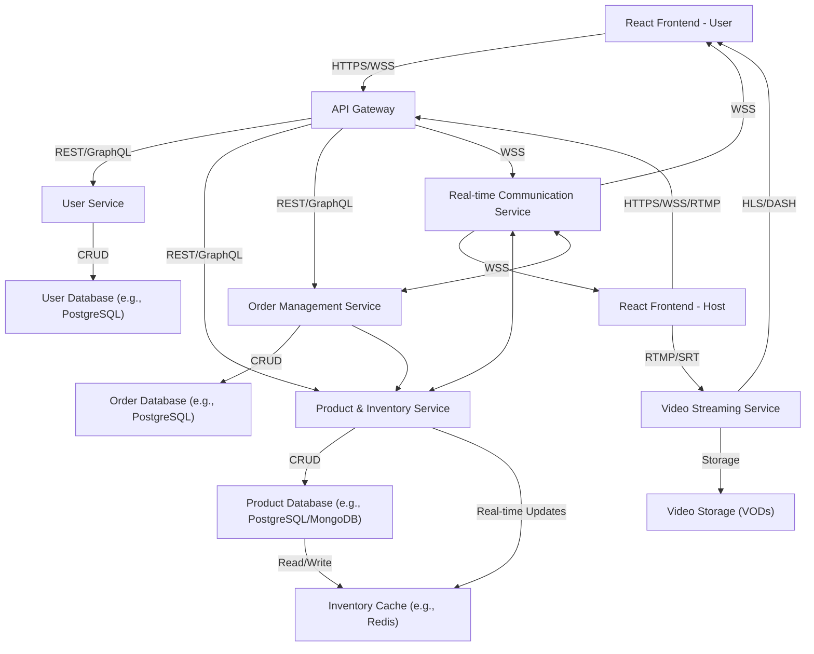

# Live-Shopping Streaming Application: System Architecture Document

## 1. Introduction

### 1.1. Purpose of the Document

This document outlines the system architecture for a live-shopping streaming application that enables hosts to stream video while promoting products, with users able to watch and purchase products in real-time.

### 1.2. System Overview

- Brief description of the live-shopping application
- Core functionalities: video streaming by host, product promotion, real-time viewing by users, real-time purchasing

### 1.3. Key Requirements

- **Scalability:** Support for hundreds of concurrent viewers and purchasers
- **Real-Time Inventory Management:** Accurate, real-time synchronization to prevent over-ordering
- **Fairness Mechanism:** Strategies to ensure equitable access to limited stock

## 2. System Architecture

### 2.1. High-Level Architecture Diagram

### 2.2. Component Descriptions

- **Frontend (React):** Separate interfaces for Users (viewing, purchasing) and Hosts (streaming, managing products)
- **API Gateway:** Single entry point for all client requests, handling routing, authentication, rate limiting
- **Video Streaming Service:** Manages video ingestion from hosts, transcoding, and delivery to viewers
- **Real-time Communication Service:** Facilitates WebSocket/SSE connections for live chat, real-time product updates, notifications (e.g., "product available," "low stock")
- **User Service:** Manages user authentication, profiles, and authorization
- **Product & Inventory Service:** Manages product information (details, pricing) and crucially, real-time inventory levels
- **Order Management Service:** Handles order creation, processing (payment placeholder), and order history
- **Databases:**
  - Relational Database (e.g., PostgreSQL): For structured data like users, orders, product core info
  - In-Memory Cache/DB (e.g., Redis): For rapid inventory checks and updates, session management, real-time features
- **(Optional) Message Queue:** For decoupling order processing or inventory updates if needed for higher load

## 3. Scalability Considerations

### 3.1. Stateless Services

Design backend services to be stateless for horizontal scaling.

### 3.2. Load Balancing

Across API Gateway, application services, and video delivery.

### 3.3. CDN for Static Assets & Video

To reduce latency and server load.

### 3.4. Database Scalability

Read replicas for databases, appropriate indexing. For inventory, Redis provides high throughput.

## 4. Real-Time Inventory Management

### 4.1. Centralized Inventory Logic

Handled by the Product & Inventory Service.

### 4.2. Atomic Operations

Use database atomic operations (e.g., `DECR` in Redis, or transactions with `SELECT FOR UPDATE` in SQL) for decrementing stock.

### 4.3. Optimistic Locking

As an alternative or complement for database updates to product details.

### 4.4. Event-Driven Updates

Product Service publishes inventory changes; Real-time Communication Service pushes updates to clients.

### 4.5. Reservation System ("Cart Hold")

- When a user initiates a purchase, an item can be temporarily "reserved" in Redis for a short duration (e.g., 5-10 minutes)
- If the order is not completed within this window, the item is automatically released back to the available inventory

## 5. Fairness Mechanism

### 5.1. Discussion of Options

- **Purchase Limits per User:** Limit the quantity of a specific item a single user can buy during a stream or within a time period. (Simple, effective for current scale)
- **Queuing System:** Users join a queue for high-demand items. Orders are processed FIFO. (Potentially useful if specific items cause sharp peaks)
- **Lottery/Raffle System:** For extremely limited items, users enter a draw. (Likely overkill for current scale)

### 5.2. Recommended Approach for "Hundreds of Users / Tens of Inventory"

- **Primary:** Implement **Purchase Limits per User** for each product
- **Secondary:** Implement the **Reservation System ("Cart Hold")** described in 4.5 to prevent inventory hogging during checkout
- **Consideration:** A lightweight, in-memory queue (e.g., using Redis lists) for specific "hot" items if initial demand spikes prove problematic, before full order processing

## 6. Technologies and Frameworks (Suggestions with Justifications)

### 6.1. Frontend

React (as specified).

### 6.2. Backend Services (API Gateway, User, Product, Order)

- **Node.js with Express.js/Fastify:**
  - _Justification:_ Excellent for I/O-bound operations, large ecosystem, JavaScript consistency with frontend, good performance for real-time applications. Fastify offers lower overhead than Express
  - _(Alternative: Python with FastAPI, Go with Gin - provide brief pros/cons if desired)_

### 6.3. Video Streaming Service

- **Managed Service (e.g., AWS Interactive Video Service (IVS), Mux, Cloudflare Stream):**
  - _Justification:_ Handles complexity of ingestion, transcoding, adaptive bitrate streaming, and global delivery. Reduces development and operational overhead significantly. For an assignment, acknowledging these services is key
  - _(Self-hosted alternative: WebRTC for ultra-low latency or RTMP ingest + HLS/DASH packaging - more complex)_

### 6.4. Real-time Communication Service

- **WebSockets (e.g., using Node.js `ws` library, Socket.IO) or Server-Sent Events (SSE) for unidirectional updates**
  - _Justification:_ WebSockets provide bidirectional communication ideal for chat and instant updates. SSE is simpler for server-to-client pushes (like stock updates)
  - _(Managed alternative: Pusher, Ably - simplify scaling and management)_

### 6.5. Databases

- **PostgreSQL:**
  - _Justification:_ Robust, reliable, feature-rich relational database for core structured data (users, products, orders). Supports transactions
- **Redis:**
  - _Justification:_ High-performance in-memory data store for caching, session management, real-time inventory counts (atomic operations), queues, and managing reservation timers

### 6.6. API Gateway

- **Managed Service (e.g., AWS API Gateway, Apigee, Kong):**
  - _Justification:_ Provides routing, rate limiting, security, monitoring out-of-the-box
  - _(Self-managed: Nginx, Express Gateway)_

### 6.7. Deployment/Infrastructure (Conceptual)

- **Containerization (Docker) & Orchestration (Kubernetes - K8s):**
  - _Justification:_ For consistent environments, scalability, and manageable deployments. K8s might be overkill for "hundreds" initially but good for future growth
- **Cloud Provider (AWS, GCP, Azure):**
  - _Justification:_ Provides managed services for databases, video, gateways, compute, and CDN, simplifying infrastructure management

## 7. Data Flow Examples (Brief Descriptions or Simple Mermaid Sequence Diagrams)

### 7.1. User Initiates Purchase

[To be detailed with sequence diagram if needed]

### 7.2. Host Updates Product Highlighted

[To be detailed with sequence diagram if needed]

## 8. Security Considerations (Brief Overview)

### 8.1. Authentication & Authorization

Implementation using JWTs for secure user authentication and role-based access control.

### 8.2. Input Validation

Comprehensive validation of all user inputs to prevent injection attacks and data corruption.

### 8.3. Secure Communication

All communications secured using HTTPS for REST APIs and WSS for WebSocket connections.

### 8.4. Protection Against Common Web Vulnerabilities

Implementation of OWASP Top 10 security practices including XSS prevention, CSRF protection, and SQL injection prevention.

## 9. Future Considerations

### 9.1. Analytics and Reporting

Implementation of comprehensive analytics for user behavior, sales metrics, and system performance monitoring.

### 9.2. Enhanced Personalization

Machine learning-based recommendation systems for personalized product suggestions and user experience optimization.

### 9.3. Scalability to Larger User Numbers

Enhanced scalability solutions including more robust queuing with Kafka/RabbitMQ, database sharding, and advanced caching strategies for handling thousands of concurrent users.
